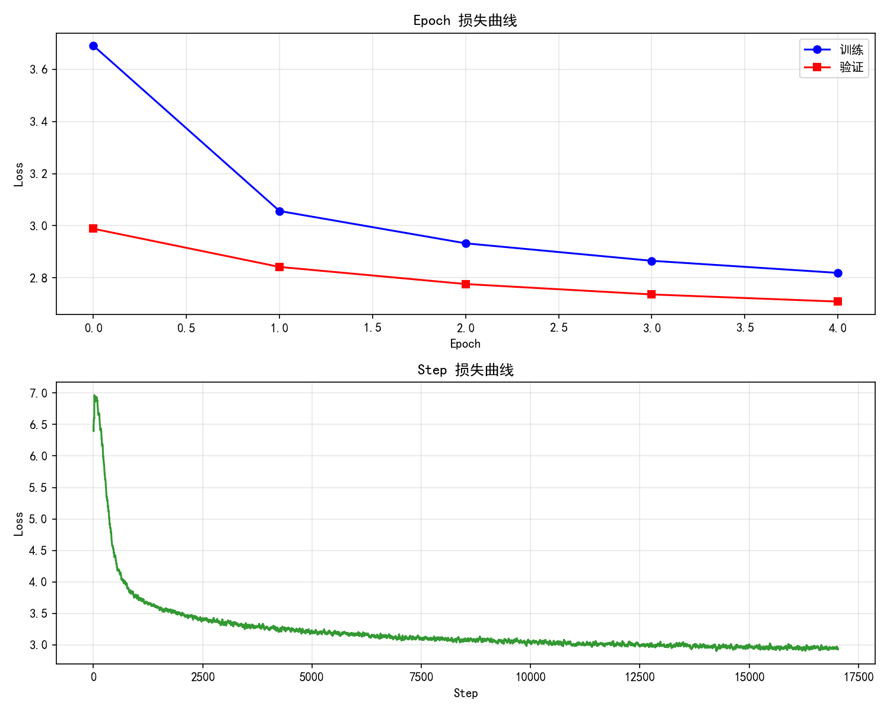

# 情感化文本生成系统

---

## 项目简介

本系统是一个基于深度学习的情感文本生成系统，旨在根据用户指定的**关键词**和**情感类别**，自动生成包含该关键词且符合指定情感倾向的自然中文句子。

系统核心采用 **BART（Bidirectional and Auto-Regressive Transformers）** 预训练模型作为生成骨干网络，其 Encoder-Decoder 架构天然适合条件生成任务：

- **Encoder** 负责理解输入的关键词和情感条件
- **Decoder** 负责自回归地生成符合条件的完整句子

支持 **6 种情感类别**：开心、伤心、生气、平静、期待、失望。

---

## 目录结构

```
Emotional-Text-Generation/
├── data/
│   ├── corpus.txt                  # 对话语料库
│   └── Emotional_Lexicon/          # 情感词典文件夹
│       ├── 正面情感词语.txt
│       ├── 负面情感词语.txt
│       ├── 正面评价词语.txt
│       ├── 负面评价词语.txt
│       ├── 程度级别词语.txt
│       └── 主张词语.txt
├── molde/                         # 训练好的模型权重
│   ├── emotion_bart_best.pt       # 最佳验证损失模型
│   ├── emotion_bart_final.pt      # 最终模型
│   └── loss_bart.png              # 训练损失曲线
├── saved/
│   └── processed_data.json        # 处理后的标注数据集
├── templates/
│   └── index.html                # Web 前端界面
├── app.py                        # Flask Web 界面后端
├── train.py                      # 主训练脚本
├── test.py                       # 命令行测试脚本
├── data_processor.py             # 数据预处理模块
├── model_utils.py                # 模型工具与数据集模块
└── README.md
```

---

## 系统架构

```
┌──────────────┐     ┌──────────────┐     ┌──────────────┐     ┌──────────────┐
│   数据获取    │ ──► │   数据处理    │ ──► │   模型训练    │ ──► │   文本生成    │
│              │     │   与标注      │     │   (微调)     │     │   (推理)     │
└──────────────┘     └──────────────┘     └──────────────┘     └──────────────┘
       │                    │                    │                    │
  对话语料库           情感词典标注         BART Encoder-Decoder   Top-K + Top-P
  (Hugging Face)      知网Hownet           AdamW + 梯度累积       采样策略
                      6种情感类别          Early Stopping          repetition_penalty
```

---

## 一、数据来源

### 1.1 对话语料库

- **来源**：[Hugging Face - b-corpus](https://huggingface.co/datasets/Limour/b-corpus)
- **类型**：游戏对话中文文本数据集，包含各类 RPG 游戏剧情文本及视觉小说文本
- **特点**：数据量丰富，包含大量具有情感色彩的对话内容

### 1.2 情感词典

- **来源**：[GitHub - 中文情感词典汇总](https://github.com/ppzhenghua/SentimentAnalysisDictionary)（知网 Hownet 情感词典中文部分）
- **包含 6 类词典文件**：

| 词典文件           | 作用                             |
| ------------------ | -------------------------------- |
| 正面情感词语.txt   | 积极情感词汇（映射至「开心」「期待」） |
| 负面情感词语.txt   | 消极情感词汇（映射至「伤心」「生气」「失望」） |
| 正面评价词语.txt   | 积极评价词汇（映射至「开心」「期待」） |
| 负面评价词语.txt   | 消极评价词汇（映射至「生气」「失望」） |
| 程度级别词语.txt   | 程度副词（映射至「平静」）             |
| 主张词语.txt       | 主张类词汇（映射至「期待」）            |

---

## 二、数据处理与转换

### 2.1 数据清洗

原始对话数据集较为混乱，需要统一整理：

1. **批量解压**原始数据文件
2. **提取纯对话文本**，去除旁白和无关内容
3. **去除多余标点符号**
4. **删除频繁出现的噪声字符串**
5. **整合为单独的 `corpus.txt` 文本文件**

### 2.2 情感标注流程

系统利用情感词典通过**词频统计**的方式为语料自动标注情感标签，避免人工标注的高成本：

```
原始句子 ──► jieba分词 ──► 统计各类情感词命中次数 ──► 取最高分情感为标签
                                                    └──► 该得分作为置信度
```

**情感词典映射关系**：

| 目标情感 | 来源词典类别                 |
| -------- | ---------------------------- |
| 开心     | 正面情感词语 + 正面评价词语   |
| 伤心     | 负面情感词语                 |
| 生气     | 负面情感词语 + 负面评价词语   |
| 平静     | 程度级别词语                 |
| 期待     | 正面情感词语 + 主张词语       |
| 失望     | 负面情感词语 + 负面评价词语   |

### 2.3 数据过滤

为保障训练数据质量，进行三层过滤：

| 过滤条件                   | 说明                                        |
| -------------------------- | ------------------------------------------- |
| 句子长度                   | 5 ≤ len(text) ≤ 100                         |
| 情感置信度阈值             | 情感得分 < 2 的样本丢弃                      |
| 情感类别                   | 不在 6 种情感类别中的样本丢弃                |

### 2.4 训练数据构建

使用**基于词性过滤的 TF-IDF** 从每个句子中提取关键词：

```python
# 使用 jieba.analyse 提取关键词，仅保留名词和动词类
keywords = jieba.analyse.extract_tags(
    text, topK=3,
    allowPOS=('n', 'ns', 'nt', 'v', 'vn')  # 名词、地名、机构名、动词、名动词
)
```

构建训练数据对：

```
输入 (Encoder):  "关键词 [情感标记]"    例: "下雨 [伤心]"
输出 (Decoder):  "包含关键词的完整句子"  例: "外面下雨了，我的心也跟着沉了下来"
```

**采样策略**：最大读取 500,000 条对话，随机采样 300,000 条，处理后得到约 242,174 条有效数据。

**数据划分**：训练集 90% / 验证集 10%。

---

## 三、模型架构

### 3.1 预训练模型

选用**复旦大学 NLP 组**发布的中文 BART 模型 `fnlp/bart-base-chinese`，从 `transformers` 库加载。

### 3.2 情感特殊标记

在 `BertTokenizer` 词表中添加 6 个情感特殊标记：

```python
special_tokens = ['[开心]', '[伤心]', '[生气]', '[平静]', '[期待]', '[失望]']
tokenizer.add_tokens(special_tokens)
model.resize_token_embeddings(len(tokenizer))
```

### 3.3 数据集类 `EmotionBartDataset`

继承 `torch.utils.data.Dataset`，实现：

- 输入文本 Tokenize：`"关键词 [情感]"` → `input_ids` + `attention_mask`
- 输出文本 Tokenize：完整句子 → `labels`（padding 位置设为 `-100`，不参与损失计算）
- 过滤长度不合适、无关键词或不在情感类别中的样本

---

## 四、模型训练

### 4.1 训练流程

```
加载预训练 BART ──► 构建数据集 ──► 按 Epoch 训练 ──► 验证评估 ──► 保存最佳模型
                                        │                  │
                                  AdamW 优化器       Early Stopping
                                  梯度累积 (×4)     (patience=2)
                                  梯度裁剪 (1.0)
                                  线性学习率预热
```

### 4.2 关键训练技术

#### 梯度累积 (Gradient Accumulation)

GPU 显存有限，无法使用过大的 batch_size，采用梯度累积技术：

```
实际 batch_size = 64，累积步数 = 4
等效 batch_size = 64 × 4 = 256
```

实现方式：每个 mini-batch 前向计算损失后，将损失除以累积步数后反向传播，累积 4 步后再更新参数。

#### 线性学习率预热 (Linear Warmup)

训练初期直接使用大学习率会导致梯度不稳定，破坏预训练权重。采用线性预热策略：

```
前 10% 的总训练步数：学习率从 0 线性增加至目标学习率 1e-5
之后 90%：学习率线性衰减至 0
```

#### 梯度裁剪 (Gradient Clipping)

```python
torch.nn.utils.clip_grad_norm_(model.parameters(), max_norm=1.0)
```

防止梯度爆炸，提高训练稳定性。

#### Early Stopping（早停机制）

监控验证损失，连续 2 个 epoch 验证损失不下降时停止训练，防止过拟合。

### 4.3 超参数设置

| 超参数                | 值            | 说明                          |
| --------------------- | ------------- | ----------------------------- |
| 学习率 (lr)           | 1e-5          | AdamW 优化器目标学习率         |
| 权重衰减 (weight_decay) | 0.01         | L2 正则化                     |
| batch_size            | 64            | 单步 mini-batch 大小          |
| 梯度累积步数           | 4             | 等效 batch_size = 256          |
| 训练轮次 (epochs)     | 5             | 最多训练 5 个 epoch            |
| 最大输入长度           | 64            | 关键词 + 情感标记的最大 token 数 |
| 最大输出长度           | 64            | 生成句子的最大 token 数        |
| 预热比例               | 10%           | 前 10% 步数线性预热            |
| 早停耐心值 (patience)  | 2             | 连续 2 轮不改善则停止          |
| 随机种子 (seed)       | 42            | 确保实验可复现                 |

### 4.4 训练结果

训练完成后自动绘制并保存损失曲线（`loss_bart.png`），包含：

1. **Epoch 损失曲线**：训练损失 vs 验证损失随 epoch 变化
2. **Step 损失曲线**：单步训练损失的滑动平均（窗口=20），展示细微收敛趋势

```
# 损失曲线示意

Epoch Loss:
  训练损失逐渐下降，验证损失同步下降，最终趋于收敛
  当验证损失不再改善时触发 Early Stopping

Step Loss (平滑后):
  初始损失较高 → 预热阶段 → 快速下降 → 逐渐平稳收敛
```

---

## 五、文本生成

### 5.1 生成策略

加载训练好的模型后，使用以下采样策略生成文本：

```
输入: "关键词 [情感]" ──► BART Encoder 编码 ──► BART Decoder 自回归生成 ──► 去重输出
```

**采样参数**：

| 参数                | 值   | 作用                                           |
| ------------------- | ---- | ---------------------------------------------- |
| `do_sample`         | True | 启用随机采样（非贪心解码）                      |
| `temperature`       | 0.9  | 控制生成随机性，值越高越随机                     |
| `top_k`             | 50   | 只从概率最高的 50 个词中选择                    |
| `top_p`             | 0.92 | 核采样，累积概率达到 92% 时截断                 |
| `repetition_penalty` | 1.2 | 降低已出现词汇的生成概率，减少重复              |
| `num_return_sequences` | 3  | 每次生成 3 个候选句子                          |
| `max_length`        | 50   | 生成句子最大长度                                |

**Top-K + Top-P 双重采样**：结合两者优势，Top-K 限制候选词数量，Top-P（核采样）基于累积概率动态调整候选集，在保证多样性的同时避免低质量词元。

**重复惩罚**：`repetition_penalty=1.2` 有效解决中文生成中常见的词汇重复问题，使生成的句子更加自然。

### 5.2 情感别名

支持用户使用多种情感同义词输入，系统自动标准化：

```python
EMOTION_ALIAS = {
    '高兴': '开心', '快乐': '开心', '愉快': '开心',
    '难过': '伤心', '悲伤': '伤心',
    '愤怒': '生气', '恼火': '生气',
    '冷静': '平静',
    '希望': '期待',
    '沮丧': '失望'
}
```

### 5.3 生成示例

---

## 六、Web 界面设计

### 6.1 技术栈

- **后端**：Flask（Python Web 框架）
- **前端**：HTML + CSS + JavaScript
- **文件对话框**：Tkinter `filedialog`（系统原生对话框）
- **异步处理**：Python `threading`（后台线程处理耗时任务）

### 6.2 界面风格

采用**深色科技风格**设计，集成训练和测试双模式。

### 6.3 训练模式

- **输入**：对话语料文件 + 情感词典文件夹
- **输出目录**：模型保存路径
- **进度条**：实时显示数据处理、模型加载、训练各阶段进度
- **终端输出**：展示训练开始/结束状态及最终损失值

### 6.4 测试模式

- **模型加载**：选择训练好的 `.pt` 模型文件，进度条显示加载状态
- **对话式交互**：输入关键词 + 选择情感按钮 → 实时展示 3 个生成句子
- **关键词验证**：生成结果以 ✓/✗ 标记是否包含关键词
- **模型卸载**：退出时自动卸载模型释放 GPU 显存

### 6.5 异步通信机制

直接在 Flask 路由中执行训练代码会导致 Web 服务无响应，系统采用以下架构：

```
前端 (setInterval 800ms 轮询)
    │
    ▼
GET /api/training_status  ◄────  后端全局状态字典 training_status
    │                                   │
    ▼                                   ▼
显示进度条                         POST /api/start_training
                                       │
                                       ▼
                                  后台线程 (threading.Thread)
                                       │
                                       ▼
                                  执行实际训练逻辑
                                  实时更新 training_status
```

### 6.6 API 接口

| 接口                     | 方法   | 功能                         |
| ------------------------ | ------ | ---------------------------- |
| `/`                      | GET    | 主页面                       |
| `/api/select_file`       | POST   | 打开系统文件选择对话框        |
| `/api/start_training`    | POST   | 启动后台训练线程              |
| `/api/training_status`   | GET    | 轮询获取训练进度和状态        |
| `/api/test_status`       | GET    | 获取模型测试状态              |
| `/api/load_model`        | POST   | 后台加载模型权重              |
| `/api/generate`          | POST   | 生成情感文本                  |
| `/api/unload_model`      | POST   | 卸载模型释放显存             |

---

## 七、快速开始

### 7.1 安装依赖

```bash
pip install torch transformers jieba flask matplotlib
```

### 7.2 命令行训练

```bash
python train.py
```

训练完成后，模型权重保存在 `molde/` 目录，损失曲线保存在 `molde/loss_bart.png`。

### 7.3 命令行测试

```bash
python test.py
```

支持交互式输入关键词和情感，或运行批量测试。

### 7.4 Web 界面

```bash
python app.py
```

启动后浏览器访问 `http://localhost:5000`，在界面中选择训练模式或测试模式。

---

## 八、核心代码模块

| 模块              | 核心类/函数                               | 功能                         |
| ----------------- | ---------------------------------------- | ---------------------------- |
| `data_processor.py` | `EmotionMapper`, `DataProcessor`         | 情感词典映射、语料加载与标注   |
| `model_utils.py`   | `EmotionBartDataset`, `load_tokenizer`, `load_model`, `extract_keywords`, `generate_text` | 模型/分词器加载、数据集构建、关键词提取、文本生成 |
| `train.py`         | `Trainer`, `data_generator`               | 训练器类、数据生成器、主训练流程 |
| `test.py`          | `EmotionGenerator`                       | 情感文本生成器（命令行交互）   |
| `app.py`           | Flask 路由 + API                          | Web 界面后端、异步训练/推理    |

---

## 九、关键技术总结

| 技术点                  | 说明                                                          |
| ----------------------- | ------------------------------------------------------------- |
| 条件生成范式             | "关键词 + 情感标记" 作为 Encoder 强约束输入                    |
| 情感词典自动标注         | 基于知网 Hownet 词典的词频统计，零人工标注成本                  |
| TF-IDF 关键词提取        | 基于词性过滤（名词+动词），自动构建训练数据对                   |
| BART 预训练微调          | 复用复旦中文 BART 的语言理解能力，适配情感生成任务              |
| 梯度累积                | 等效 batch_size=256，解决 GPU 显存限制                         |
| 线性学习率预热           | 前 10% 步数预热，保护预训练权重不被破坏                         |
| Early Stopping          | patience=2，实时监控验证损失防止过拟合                          |
| Top-K + Top-P 核采样     | 双重采样策略，保证生成多样性与质量                               |
| 重复惩罚                | repetition_penalty=1.2，减少中文生成中的词汇重复               |
| 后台线程异步训练         | threading + 轮询机制，Web 界面实时展示训练进度                   |

---
